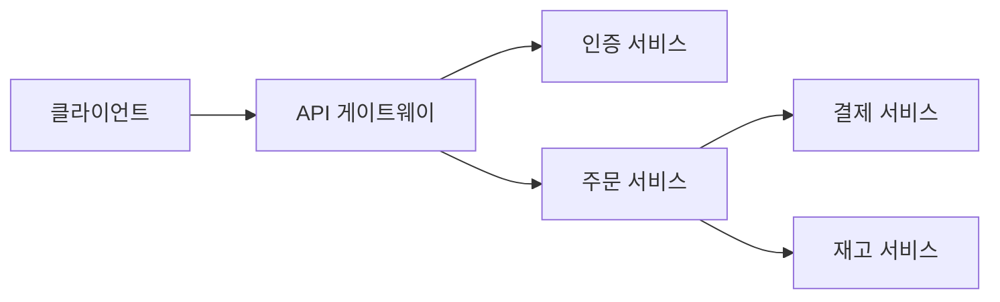

# 컨텍스트는 왕이다

Claude Code 운영의 **1 순위 가치**. 모델 성능·프롬프트·도구 선택보다 컨텍스트 관리가 결과 품질을 더 크게 좌우한다는 테제.

## 3 가지 하위 원칙

### 1. 세컨드 브레인 = 로컬 마크다운

- 의사결정의 **이유**를 프로젝트 폴더의 마크다운 파일로 저장
- `/memory` 커맨드 또는 자연어 "기억해줘" 로 자동화
- 수동 관리 불필요 — Claude 가 알아서 상기

> 📌 이 vault 의 `wiki/` 시스템 자체가 이 원칙의 확장판. [[llm-wiki-pattern]] 참조.

### 2. LazyLoading — CLAUDE.md 다이어트

- `CLAUDE.md` 는 **매 세션 전체 로드** → 비대하면 매 세션 토큰 낭비
- 루트에는 **규칙·참조 포인터만**
- 상세 가이드는 별도 `.md` 파일, `CLAUDE.md` 엔 file path 로만 언급
- 폴더별 `CLAUDE.md` 분산도 유효
- **핵심: 루트 CLAUDE.md 를 비대하게 두지 말 것**

> 📌 현재 이 vault 의 `CLAUDE.md` 는 ~250 줄. 이 원칙 관점에서 재검토·분할 후보 — 다음 lint 에서 플래그.

### 3. 한 세션 = 한 피쳐

- 작업을 작게 쪼개기
- 세션이 길어지면 `/compact` 또는 `/clear`
- 컨텍스트 윈도우 마지막 20% 는 피쳐 구현·복잡 리팩터링에 사용하지 않기

## 컨텍스트 관리 커맨드 총정리

| 커맨드 | 용도 | 언제 |
|---|---|---|
| `/clear` | 완전 초기화 | 새 피쳐 시작 전 |
| `/compact` | 요약 압축 | 세션 중 컨텍스트 80% 도달 시 |
| `/context` | 현재 사용량 바 | 수시 |
| `/export` | 파일로 추출 | 다른 AI 교차검증 / 아카이브 |
| `/resume` | 세션 재개 | 중단된 작업 이어가기 |
| `/model` | 모델 전환 | 병렬 서브에이전트엔 Sonnet |
| `/memory` | 장기 기억 | 의사결정 이유·선호도 저장 |

## 컨텍스트 절약 전술 (원 소스 종합)

- **이미지·다이어그램**으로 아키텍처 설명 (글보다 압축률 ↑, l.81)
- **Mermaid** 로 구조 기술 (l.79)
- **`!` 접두사** bash 로 즉시 실행 (명령 결과만 컨텍스트에)
- **커스텀 MCP** 만 쓰고 범용 MCP 는 자제 (l.164)
- [[plan-mode-workflow|Plan Mode]] — 재생성 방지로 output 토큰 절감
- [[sub-agents]] — 메인 컨텍스트 오염 방지

## CLAUDE.md 안의 Mermaid 아키텍처

핵심 전술 중 하나: `CLAUDE.md` 자체에 **시스템 아키텍처를 Mermaid 로** 박아두면, Claude 가 매 세션 자동으로 시스템 토폴로지를 이해하고 들어온다. 글로 설명하는 것보다 토큰 효율이 훨씬 높음.

예 (마이크로서비스):

→ Claude 가 새 피쳐 작업 시 어떤 서비스를 건드려야 하는지 즉시 파악. 인증·결제·재고 같은 횡단 관심사 누락도 줄어듦.

**원칙**:

- **그림 한 장 = 백 마디 말** — 특히 호출 그래프·계층 구조·상태 머신
- Mermaid 는 **텍스트로 저장 가능** → diff·리뷰·버전관리 친화적
- 시스템이 진화할 때마다 Mermaid 도 업데이트해야 가치 유지 (스테일 다이어그램은 오히려 해)

(스크린샷: `![[스크린샷 2026-04-17 오후 3.11.06.png]]`)

## 이 위키와의 관계

- `wiki/index.md` — 컨텍스트 첫 진입점. LLM 이 여기부터 읽어 후보 페이지만 정독 (전체 스캔 금지) = LazyLoading 의 위키판
- 각 페이지의 `sources:` 프론트매터 — 역추적 가능성 = 세컨드 브레인 원칙

## Harness 관점 — "기계가 읽는 컨텍스트"

[[harness-engineering]] 의 **첫째 기둥** 이 바로 이 개념의 상위 프레이밍. LazyLoading·세컨드 브레인은 **전술**이고, 그것을 포함하는 전략적 범주가 "기계가 읽는 컨텍스트" 기둥이다:

- 저장소 안 AI 런타임 설정 파일 (`CLAUDE.md`, `docs/`)을 **박제된 규칙**으로 배치
- 규칙은 AI 가 매 세션 자동 로드하므로 사람이 상기시킬 필요 없음
- 규칙이 비대해지면 LazyLoading 으로 분할 (이 개념이 하위에 들어감)

→ 따라서 이 페이지의 원칙들은 Harness Engineering 의 한 기둥을 **어떻게 실천할지**에 대한 Claude Code 버전 전술로 읽으면 정확.

## 관련 개념

- [[llm-wiki-pattern]] — 세컨드 브레인의 확장 형태
- [[plan-mode-workflow]] — 컨텍스트 보존 전술 중 하나
- [[wat-framework]] — WAT 의 궁극 목적

## 근거 소스

- [[claude-code-study-notes]] l.58-74, l.42-56, l.152-165
