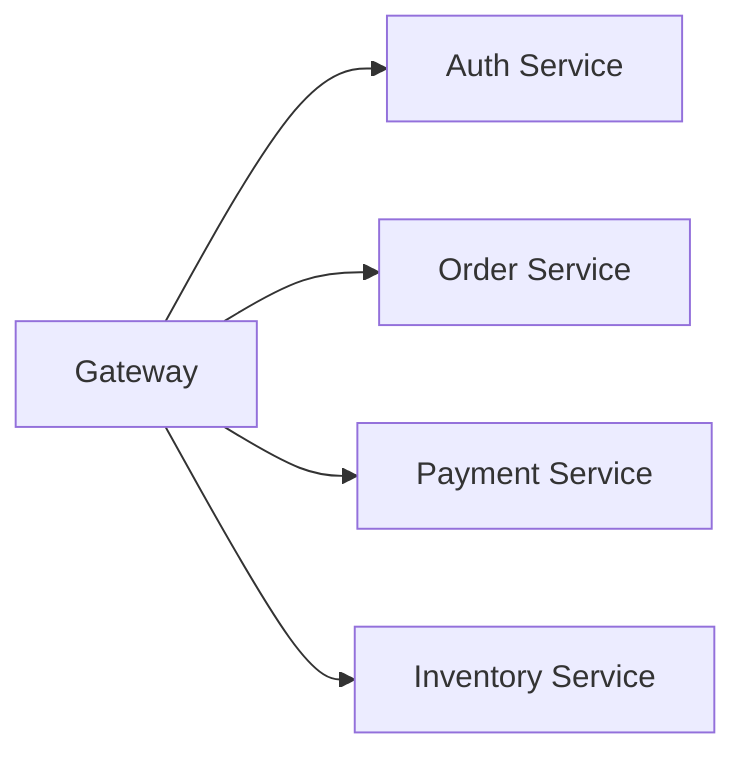

# Context Engineering

## 핵심 요약

Claude Code 에서 **답변 품질은 컨텍스트 관리가 결정한다**. 200k 토큰 윈도우는 실제 작업에선 금방 찬다. 핵심 기법 네 가지: **(1) Lazy loading** — 필요할 때만 로드, **(2) 세컨드 브레인** — 누적 지식 재사용, **(3) MCP 다이어트** — 도구 설명도 토큰, **(4) 세션 위생** — 한 세션 한 피처. 공통 원칙: **신선한 컨텍스트 > 부풀어진 컨텍스트** ([[concepts/fresh-context-principle]]).

> [!note] 상위 프레임 위치
> Context Engineering 은 [[concepts/four-axes-ai-development|AI 개발 4축]] 중 **2번째 축**. 위로는 [[concepts/harness-engineering|Harness]] · [[concepts/agentic-engineering|Agentic]] 이 쌓인다. 이 페이지가 다루는 기법은 **정보를 잘 주는 기술** — 정보를 다 줘도 AI 가 엉뚱한 행동을 하는 영역 (규칙·울타리 문제) 은 하네스의 몫.

## 1) Lazy Loading

### 안티 패턴

`CLAUDE.md` 하나에 API 스펙 50개 + DB 스키마 40개를 몰아넣기. 매 세션마다 수천 토큰 낭비. 실제 작업에 필요한 건 5% 미만.

### 권장 패턴

`CLAUDE.md` 는 **규칙과 구조만**. 상세는 별도 파일로 분리하고 참조로 연결:

```markdown
## 참조

- API 엔드포인트: `docs/api-spec.md`
- DB 스키마: `docs/db-schema.md`
- 아키텍처: `docs/architecture.md`
```

Claude 는 "DB 스키마 업데이트해줘" 요청을 받으면 `db-schema.md` **하나만** 읽고 작업. 나머지 파일은 로드되지 않음.

### 폴더별 `CLAUDE.md` 분할

`apps/api/CLAUDE.md`, `apps/web/CLAUDE.md` 처럼 도메인별로 쪼개면 작업 경로에 따라 해당 파일만 로드됨 → [[concepts/claude-md#분할]].

### `.claude/rules/` 조건부 로딩

폴더 분할이 *도메인 단위* 라면, `.claude/rules/*.md` 는 *파일 타입 단위* 의 lazy loading. 각 파일 frontmatter 에 glob 패턴을 지정하면 Claude 가 해당 패턴의 파일을 건드릴 때만 규칙을 로드한다. 오픈소스 사례:

- **Trigger.dev** — `.claude/rules/database-safety.md` 가 DB 파일 작업 시만 로드
- **CockroachDB** — 모든 `.go` 파일에 PII 로그 마스킹 규칙 자동 강제

자세히 → [[concepts/conditional-rule-loading]].

## 2) 세컨드 브레인

프로젝트를 거치며 배운 것들 — **패턴, 해결책, 의사결정 이유** — 을 로컬 마크다운에 누적. 다음에 비슷한 작업 시 Claude 에게 해당 파일을 읽힘.

### 수동 관리

```
docs/decisions.md
docs/patterns.md
docs/debugging-notes.md
```

### 자동 관리 (신기능)

`/memory` 슬래시 명령어가 자동화해준다:

- Claude 가 작업하며 학습한 내용을 `memory.md` 에 자동 저장
- 빌드 명령 · 디버깅 인사이트 · 코드 패턴
- 매 세션 시작 시 자동 로드

```
"이거 기억해줘" → Claude 가 memory.md 에 저장
/memory           → 현재 메모리 확인/편집
```

> [!note] 역할 분담
> - **개인 메모리** → `/memory` (자동)
> - **팀 공유 컨텍스트** → `CLAUDE.md` (명시적, git 커밋)

**이 위키 자체가 세컨드 브레인의 상위 개념** → [[concepts/llm-wiki-pattern]].

## 3) MCP 다이어트

MCP 서버는 **세션 시작 시 도구 설명 전부 로드**. 10개 연결 = 10개 전부 토큰 점유 (사용 여부 무관).

### 체크

```
/mcp
```

현재 연결된 MCP 목록 확인. 현재 작업에 안 쓰는 MCP 는 **Disable**.

### 커스텀 MCP 권장

Notion · Linear 같은 범용 MCP 는 도구 설명이 매우 크다. 자주 쓰는 엔드포인트만 골라 **커스텀 MCP** 로 래핑:

- 토큰 절약
- 응답 품질 향상
- 예시: Plan Review MCP — Plan 모드 결과를 Gemini API 에 보내 리뷰

### MCP vs Skills vs Subagents (컨텍스트 점유 비교)

| 기능 | 평소 점유 | 실행 중 |
|---|---|---|
| **MCP** | 연결된 도구 설명 전부 상시 | 호출 시 추가 |
| **Skills** | description 만 (50~100B) | on-demand 로드 |
| **Subagent** | 이름/도구/프롬프트 상시 | 별도 컨텍스트에서 실행 → 메인 오염 없음 |

결론: 간단한 작업은 MCP 대신 **스킬 또는 로컬 스크립트** 를 쓰는 게 더 가볍다.

## 4) 세션 위생

### 한 세션 = 한 피처

로그인 구현 → **로그인만**. 끝나면 `/clear` 또는 새 세션 → 다음 피처.

여러 기능을 한 세션에서 연달아 구현하면 컨텍스트가 누적 오염됨.

### 작업 세분화

- ❌ "결제 시스템 전체 만들어줘"
- ✅ "Stripe 웹훅 핸들러 구현해줘"

쪼개려면 [[concepts/plan-mode|Plan 모드]] 가 선행되어야 한다.

### 컨텍스트 관리 명령어

| 명령어 | 용도 | 단위 |
|---|---|---|
| `/context` | 현재 토큰 사용량 확인 | 진단 |
| `Esc Esc` | **리와인드** — 특정 시점 이후 기록 도려내기 | 메시지 |
| `/clear` | 전체 히스토리 초기화 | 세션 종료 |
| `/compact` | 요약만 남기고 나머지 압축 (방향 지시 권장) | 세션 연장 |

**리와인드 우선** — Claude Code 팀이 *"컨텍스트 관리 잘하는 사람의 단 하나의 습관"* 으로 꼽음 ([[sources/jay-choi-9-tips]]). 실패한 시도가 컨텍스트에 남아 후속 답변을 오염시키므로, *"A 말고 B 로 해 줘"* 보다 **리와인드 후 B 를 새로 요청** 하는 게 결과물이 깨끗하다. → [[concepts/rewind-pattern]].

**`/compact` 의 방향 지시** — 그냥 호출 시 Claude 가 임의로 요약. 방향을 명시:

```
/compact 이번엔 A 에 집중하고 B 는 버려
```

> 현실적 조언: 매번 `/context` 체크하고 `/compact` 하는 건 비현실적. **세션 분리 습관** + 리와인드가 이를 불필요하게 만든다.

## 5) 무거운 작업은 스크립트로 오프로드

10만 행 CSV 마이그레이션을 Claude 대화 안에서 처리 → 파일 전체가 컨텍스트에 쌓임 → 오염 + 비용 폭증.

### 권장 패턴

```
1. Claude 에게: "이 CSV 를 파싱하는 DB 마이그레이션 스크립트를 짜줘"
2. Claude 가 스크립트 작성
3. 스크립트 실행 → JSON 요약 출력
4. Claude 에게 요약만 전달 → 다음 작업
```

**AI 추론과 코드 실행을 분리** — WAT 프레임워크의 핵심 원칙과 동일.

## 6) Mermaid 다이어그램 아키텍처

말로 아키텍처를 설명하면 토큰 낭비 + Claude 가 매번 재해석. Mermaid 로 `docs/architecture.md` 에 저장:



Claude 는 이 다이어그램만 읽고 전체 구조 파악. 매번 말로 설명할 필요 없음.

## 관련 페이지

- [[concepts/fresh-context-principle]] — 본 페이지의 4기법을 묶는 한 줄 원칙
- [[concepts/four-axes-ai-development]] — 4축 상위 프레임에서의 위치
- [[concepts/harness-engineering]] — 정보의 층을 넘어서는 규칙·울타리 층
- [[concepts/claude-md]] — lazy loading 의 실무 적용
- [[concepts/conditional-rule-loading]] — Lazy Loading 의 파일 타입 기반 구현
- [[concepts/rewind-pattern]] — 메시지 단위 미세 도구
- [[concepts/plan-mode]] — fresh context 로 구현 진입
- [[concepts/claude-skills]] — MCP 대체 수단
- [[concepts/subagents]] — 컨텍스트 격리로 오염 방지
- [[concepts/llm-wiki-pattern]] — 세컨드 브레인의 상위 개념

## 출처

- [[sources/claude-code-2h-mastery]] — 실전편 "컨텍스트 관리" 섹션 전체
- [[sources/harness-engineering-era]] — 4축 프레임 중 2번째 축으로의 재위치
- [[sources/jay-choi-9-tips]] — 신선/비대 표어, 리와인드 우선, /compact 방향 지시
